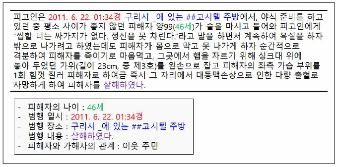
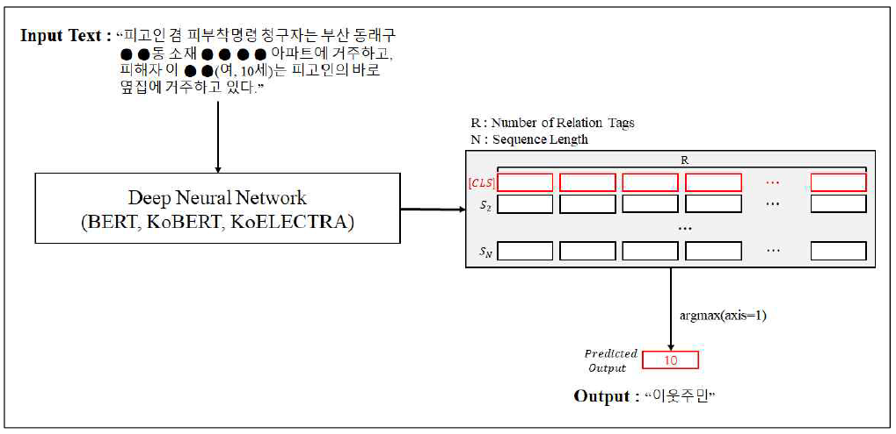
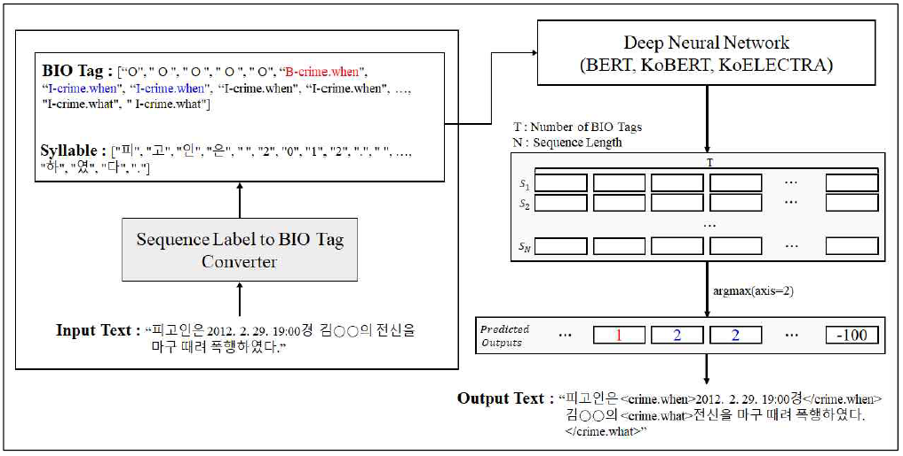

# AILAW : Artificial Intelligence LAW

**AILAW**는 대표적인 전문가용 문서의 하나인 판례에서의 범죄 사실에 대한 주요 정보를 자동으로 추출하기 위한 데이터셋 및 방법론을 제안합니다.

---



---

**AILAW**에서는 판례 내에서 주요 정보를 추출하기 위해 다음과 같은 두 가지 기술을 사용합니다.
* Text Classification : 판례 내에서 `피해자와 가해자간의 관계`를 분류하기 위해 사용합니다.
* Sequence Labeling (정확히는 Named Entity Recognition) : 판례 내에서 `피해자의 나이`, `범행 일시`, `범행 장소`, `범행 내용`을 추출하기 위해 사용합니다.

**AILAW**는 위의 방법들을 기계학습 기반(또는 딥러닝)의 방법으로 해결하기 위해 다음의 두 가지 데이터셋을 제공합니다. 판례 데이터는 [리걸서치](https://legalsearch.kr/)에서 성범죄에 관련된 판례들만을 크롤링했습니다.
* CSII(Case Information Inference) : 문장 단위의 텍스트들에 대한 `피해자와 가해자간의 관계`를 사전에 정의한 관계 태그들이 부착되어 있는 데이터셋입니다.
* CSIE(Case Information Extraction) : 문장 단위의 텍스트들에 대한 `피해자의 나이`, `범행 일시`, `범행 장소`, `범행 내용`에 해당하는 부분의 시작 위치와 종료 위치가 기록되어 있는 데이터셋입니다.

마지막으로, **AILAW**는 수집한 데이터들을 통해 판례의 범죄 사실 내에서 주요 정보를 자동으로 추출하는 실험 코드를 제공합니다.

## Dependencies
* torch>=1.7.0
* pytorch-lightning==1.0.0
* transformers>=4.0.0
* scikit-learn
* openpyxl
* pandas
* matplotlib
* selenium
* xlsxwriter
* xlrd
* seqeval

## Crawler
`crawler/run_crawler.py`를 통해 [리걸서치](https://legalsearch.kr/)에서 판례 데이터를 크롤링하실 수 있습니다.

현재 코드는 리걸서치에서 성범죄와 관련된 키워드들을 검색하였을 때, 검색되는 판례들만을 크롤링하도록 되어 있습니다. **만약, 다른 유형의 판례들도 수집하고 싶으시다면 main 함수의 `keywords` 리스트에 검색할 키워드들을 입력하여 코드를 실행해주시기 바랍니다.**

## Dataset

[리걸서치](https://legalsearch.kr/)에서 성범죄 관련 판례 251건, 폭행 관련 판례 155건, 살인 관련 판례 30건을 수집하였고 두 가지 이상의 유형이 함께 나와서 중복된 경우를 제외하여 최종적으로 402건의 판례를 수집하였습니다. 수집한 판례에 대한 통계량은 다음과 같습니다.

<table>
    <tr>
        <td>수집한 판례 문서 수(개)</td>
        <td>402</td>
    </tr>
    <tr>
        <td>판례 내의 평균 범죄 사실 수(개)</td>
        <td>2.26</td>
    </tr>
    <tr>
        <td>수집한 총 문장 수(개)</td>
        <td>1595</td>
    </tr>
    <tr>
        <td>각 문장의 평균 글자 수(개)</td>
        <td>173.64</td>
    </tr>
    <tr>
        <td>수집한 문장에서의 최대 글자 수(개)</td>
        <td>955</td>
    </tr>
</table>

데이터를 수집함에 있어서 2심과 3심 판례 문서는 1심 판례 문서를 기반으로 작성되기 때문에 범죄 사실이 기술되어 있지 않는 경우가 많습니다. 따라서, 수집 대상을 1심 판례로만 한정하였습니다.

### 1. CSII(Case Information Inference) 데이터셋
CSII 데이터셋은 `피해자-가해자의 관계`에 대한 정보를 사전에 정의한 관계로 추론하기 위한 데이터셋입니다. 이 데이터셋에서 사전에 정의한 관계와 누적 수 및 비율은 다음과 같습니다.

| 관계       | 누적 수(개) | 비율(%) |            
| --------- | --------- | ------- |
| 부부       | 29        | 0.018   |
| 연인       | 12        | 0.008   |
| 친족관계    | 159       | 0.100   |
| 동료/동업   | 74        | 0.046   |
| 손님-점원   | 64        | 0.040   |
| 스승-제자   | 67        | 0.042   |
| 이웃주민    | 18        | 0.011   |
| 지인       | 235       | 0.147   |
| 군대 관련   | 23        | 0.014   |
| 종교 관련   | 8         | 0.005   |
| 형사-피의자 | 139       | 0.087    |
| 낯선 사람   | 296       | 0.186    |
| 알 수 없음  | 471       | 0.295    |

### 2. CSIE(Case Information Extraction) 데이터셋
CSIE 데이터셋은 `범행 일시`, `범행 장소`, `범행 내용`, `피해자의 나이`의 4가지 정보를 추출하기 위한 데이터셋입니다. 이 데이터셋에 설명 및 예시, 누적 수는 다음과 같습니다.

| 태그명        | 설명           | 예시                   | 누적 수(개) |           
| ------------ | ------------- | --------------------- | ---------- |
| crime.when   | 범행 일시      | 2013. 6. 초순 21:00경   |  929       |
| crime.where  | 범행 장소      | 피해자 고△△의 거주지 현관 |  887       |
| crime.what   | 범행 내용      | 추행하였다.              |  2321      |
| victim.age   | 피해자의 나이   | 30세                   |  549       |

## Usage
### 1. Pre-processing Dataset

* CSII 데이터셋 전처리 : `data/csii`로 이동하여 다음과 같은 명령어를 수행해주시기 바랍니다. 수행한 결과, `data/csii/train.tsv`, `data/csii/dev.tsv`, `data/csii/label.vocab` 파일들이 생성됩니다.
    ```bash
    python 99_build_all_classification.py
    ```
    
* CSIE 데이터셋 전처리 : `data/csie`로 이동하여 다음과 같은 명령어를 수행해주시기 바랍니다. 수행한 결과, `data/csie/train.tsv`, `data/csie/dev.tsv`, `data/csie/label.vocab`, `data/csie/train.bio.txt`, `data/csie/dev.bio.txt` 파일들이 생성됩니다.
    ```bash
    python 99_build_all_ner.py
    ```

### 2. CSII를 이용한 관계 추론 실험 (Text Classification)

---



---

다음과 같은 명령어를 통해 수행합니다.

* `--do_train` : 학습 모드 수행
* `--do_predict` : 예측 모드 수행
* `--text_reader` : 모델 유형
* `--max_seq_length` : 입력 시퀀스의 최대 길이
* `--batch_size` : 배치 크기
* `--gpu_id` : 학습 및 예측에 사용할 GPU의 ID

```bash
python run_classification_pl.py --do_train \
                                --do_predict \
                                --text_reader bert \
                                --max_seq_length 512 \
                                --batch_size 8 \
                                --gpu_id 0
```

### 3. CSIE를 이용한 범죄 사실 내 정보 추출 실험 (Sequence Labeling, Named Entity Recognition)

---



---

다음과 같은 명령을 통해 수행합니다.

* `--do_train` : 학습 모드 수행
* `--do_predict` : 예측 모드 수행
* `--text_reader` : 모델 유형
* `--max_seq_length` : 입력 시퀀스의 최대 길이
* `--batch_size` : 배치 크기
* `--gpu_id` : 학습 및 예측에 사용할 GPU의 ID

```bash
python run_ner_pl.py --do_train \
                     --do_predict \
                     --text_reader bert \
                     --max_seq_length 512 \
                     --batch_size 8 \
                     --gpu_id 0
```

## Result

실험을 위해서는 Multilingual BERT, [KoBERT](https://github.com/monologg/KoBERT-Transformers), [KoELECTRA](https://github.com/monologg/KoELECTRA) 언어모델들을 사용하였습니다.

### 1. CSII를 이용한 관계 추론 실험 (Text Classification)

| 모델                 | Accuracy      | F1 Score     |           
| ------------------- | ------------- | ------------ |
| Multilingual BERT   | 0.599         | 0.597        |
| KoBERT              | **0.650**     | **0.631**    |
| KoELECTRA           | 0.610         | 0.583        |


### 2. CSIE를 이용한 범죄 사실 내 정보 추출 실험 (Sequence Labeling, Named Entity Recognition)

| 모델                 | Precision     | Recall       | F1 Score     |          
| ------------------- | ------------- | ------------ | ------------ |
| Multilingual BERT   | **0.565**     | 0.658        | **0.606**    |
| KoBERT              | 0.426         | 0.553        | 0.477        |
| KoELECTRA           | 0.540         | **0.659**    | 0.590        |


## Contributors
- Sehun Heo (https://github.com/Se-Hun)
- Junho Won (https://github.com/junho-one)

## References
* [리걸서치](https://legalsearch.kr/)
* [huggingface/transformers](https://github.com/huggingface/transformers)
* [monologg/KoBERT-Transformers](https://github.com/monologg/KoBERT-Transformers)
* [monologg/KoELECTRA](https://github.com/monologg/KoELECTRA)
